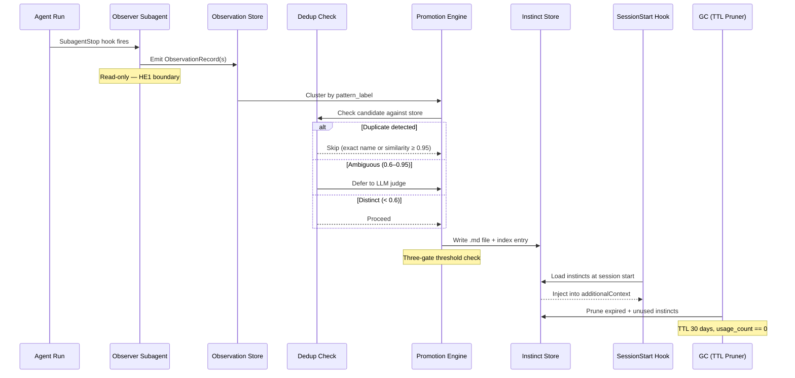

# Instincts — Learned Behavioral Patterns

Instincts are reusable behavioral patterns distilled from agent
observations. They survive across sessions and guide future agent
behavior, forming the core of the continuous-learning loop.

## Lifecycle



## Stages

### 1. Capture

**Source**: `agents/observer-subagent.md`

The observer subagent analyzes finished agent transcripts and emits
`ObservationRecord` rows. Each record carries a `type` (one of 9
canonical types — see `docs/OBSERVATION_PIPELINE.md`), `evidence`,
`confidence`, and an optional `pattern_label` for clustering.

**Acceptance criteria**: Record passes `ObservationRecord.__post_init__`
validation — all required fields non-empty, `type` in the enum,
`confidence` in [0.0, 1.0].

### 2. Extract

**Source**: `observation_store.py`

Records are appended to the JSONL observation log via atomic writes
(temp file + `os.replace` + `fcntl.flock`). The store enforces a
configurable cap (`DEFAULT_OBSERVATION_CAP = 200`) and provides
`stats()` for pipeline health monitoring.

**Acceptance criteria**: Record round-trips through `to_dict()` /
`from_dict()` without data loss; concurrent writers do not corrupt the
log.

### 3. Store

**Source**: `instinct_store.py`

The instinct store manages the on-disk layout under `~/.claude/instincts/`:
- `index.json` — JSON-backed metadata index
- `{scope}/{type}/{name}.md` — one rendered instinct per file

Scopes: `global` (shared) or `{project_id}` (project-specific).

**Acceptance criteria**: `InstinctEntry` passes `__post_init__`
validation; SHA-256 checksum matches on-disk content; concurrent
10-thread writes produce no corruption or loss.

### 4. Dedup

**Source**: `instinct_store.dedup_instinct()`

Two-stage deduplication prevents redundant instincts:

| Stage | Method | Threshold | Outcome |
|-------|--------|-----------|---------|
| 0 | Exact name match | — | Immediate duplicate |
| 1 | SequenceMatcher on description | ≥ 0.95 | Immediate duplicate |
| 1 | SequenceMatcher on description | < 0.6 | Immediate distinct |
| 2 | LLM judge (when available) | [0.6, 0.95) | Semantic decision |
| 2 | No LLM judge | [0.6, 0.95) | Conservative: treat as distinct |

**Acceptance criteria**: Exact-name duplicates caught without LLM call;
distinct instincts (< 0.6 similarity) preserved; ambiguous zone defers
to LLM when available.

### 5. Promote

**Source**: `promotion_engine.py`

The promotion engine applies a three-gate threshold before writing an
instinct:

| Gate | Default | Env override |
|------|---------|-------------|
| `occurrences` | ≥ 3 | `PLATXA_PROMOTION_THRESHOLDS` |
| `confidence` | ≥ 0.7 | `PLATXA_PROMOTION_THRESHOLDS` |
| `success_count` | ≥ 1 | `PLATXA_PROMOTION_THRESHOLDS` |

All three gates use inclusive `>=` comparison. Promotion targets:
skill, command, agent, or template.

**Acceptance criteria**: Candidate below any threshold is rejected;
`PromotionThresholds.from_env()` parses env var or falls back to
defaults; distillation produces non-empty output.

### 6. Use

**Source**: `hooks_generator.generate_session_start_context_script()`

At session start, the SessionStart hook loads all instinct `.md` files,
concatenates them with progress data, and emits the combined text as
`additionalContext`. Instincts are prioritized over progress when the
character budget (`max_chars`, default 10000) is exceeded.

**Acceptance criteria**: Instincts appear in stdout; truncation drops
progress first; empty instincts directory produces no output.

### 7. Prune

**Source**: `instinct_store.gc_expired_instincts()`

Garbage collection removes instincts that are both expired and unused:

| Condition | Outcome |
|-----------|---------|
| `(now - last_seen) > ttl_days` AND `usage_count == 0` | Pruned |
| `last_seen` within TTL window | Retained |
| `usage_count > 0` (any age) | Retained |
| Empty `last_seen` | Retained (conservative) |

Default TTL: 30 days. Supports `dry_run` mode.

**Acceptance criteria**: Expired unused instincts pruned; used instincts
retained regardless of age; boundary cases (exact cutoff, zero TTL)
behave correctly.

## Threshold Tuning

### Dedup thresholds

| Constant | Value | Effect of raising | Effect of lowering |
|----------|-------|-------------------|--------------------|
| `DEDUP_FAST_ACCEPT` | 0.95 | Fewer false-positive dedup (more near-duplicates kept) | More aggressive dedup (risk losing distinct instincts) |
| `DEDUP_FAST_MAYBE` | 0.6 | Larger ambiguous zone → more LLM calls | Smaller ambiguous zone → more false negatives |

### Promotion thresholds

Set via `PLATXA_PROMOTION_THRESHOLDS` env var (JSON object):

```bash
export PLATXA_PROMOTION_THRESHOLDS='{"occurrences": 5, "confidence": 0.8, "success_count": 2}'
```

Higher values produce fewer but higher-quality instincts. Lower values
accelerate learning but may promote noise.

### GC threshold

| Constant | Value | Effect of raising | Effect of lowering |
|----------|-------|-------------------|--------------------|
| `DEFAULT_TTL_DAYS` | 30 | Instincts live longer (more memory use, staler patterns) | Faster churn (risk losing slow-burn patterns) |
