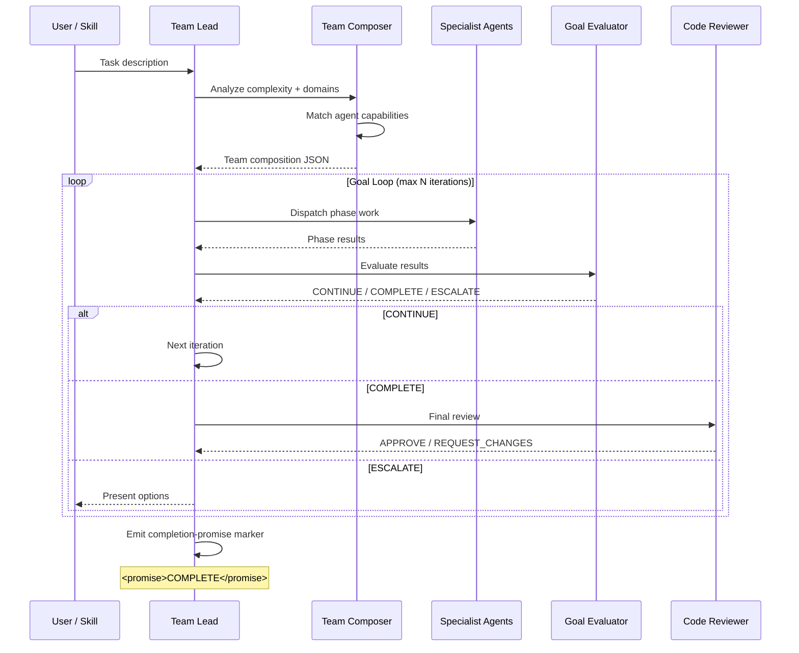

# Orchestration — Multi-Agent Coordination

The orchestration layer composes, dispatches, evaluates, and iterates
agent teams to complete complex tasks. It implements patterns from
Anthropic's "Building Effective Agents" research and the
effective-harnesses guidance from Geoff Huntley's Claude Code best
practices.

## Orchestration Flow

## Composition Patterns

The `agent_composer.py` module provides four composition functions,
each implementing an Anthropic-recommended pattern:

| Pattern | Function | Use Case |
|---------|----------|----------|
| **Sequential** (Prompt Chaining) | `compose_sequential()` | Fixed ordered steps — each agent's output feeds the next |
| **Parallel** (Parallelization) | `compose_parallel()` | Independent concurrent subtasks — fan out, collect results |
| **Conditional** (Routing) | `compose_conditional()` | Input classification to specialized handlers |
| **Router** | `compose_router()` | Dynamic routing table with fallback handler |

### Composition → Dispatch → Evaluate → Iterate

1. **Compose**: The team composer analyzes task complexity, identifies
   required domains, and selects agents with matching capabilities.
   Output: a team composition JSON with task assignments.

2. **Dispatch**: The team lead dispatches agents phase-by-phase. For
   independent work, multiple `Task` tool calls in a single assistant
   message achieve true concurrency (the parallel-dispatch pattern).

3. **Evaluate**: The goal evaluator checks test results, review verdicts,
   quality output, and spec alignment. Returns a structured
   `CONTINUE / COMPLETE / ESCALATE` decision with 5-dimension scoring.

4. **Iterate**: On `CONTINUE`, the team lead adjusts and re-dispatches.
   On `COMPLETE`, the final review gate runs. On `ESCALATE`, the user
   is presented with options.

## Escalation Criteria

The system escalates to the user when:

| Trigger | Source | Action |
|---------|--------|--------|
| **Max iterations reached** | `WorkflowState.max_iterations` (default 5) | Block further retries; present current state |
| **Competing hypotheses tied** | `multiagent_generator.py` | Present both hypotheses with evidence |
| **Reviewer REQUEST_CHANGES after 3 fix attempts** | Phase 7 retry loop | Ask user: fix / defer / proceed |
| **Goal evaluator ESCALATE** | `goal_evaluator` agent | Present 5-dimension scores and blockers |
| **Approval gate (complexity ≥ 7)** | Phase 5 entry | Explicit AskUserQuestion before implementation |

### Iteration Cap

The `WorkflowState` enforces a `max_iterations` cap on the
VALIDATION → GENERATION retry loop:

- Default: 5 iterations
- Serialized in workflow state JSON for persistence across sessions
- When exhausted: transition is rejected with "Max iterations (N)
  reached" message
- The blocked transition does not mutate state — the workflow stays
  in VALIDATION and can still advance to INSTALLATION

## Team Lead vs Ralph Orchestrator

| Aspect | Team Lead | Ralph Orchestrator |
|--------|-----------|-------------------|
| **Scope** | Full feature lifecycle | Single completion-promise loop |
| **Phases** | Discovery → Architecture → Generation → Validation → Installation → Learning | Write → verify → emit marker |
| **Termination** | Pass-gate Edit on `feature_list.json` | Stop-hook regex check for `<promise>COMPLETE</promise>` |
| **Iteration** | Goal evaluator CONTINUE/COMPLETE/ESCALATE | Ralph re-prompt until marker or cap |
| **State** | `WorkflowState` with checkpoints | Stateless (iteration count in payload) |

## Completion-Promise Protocol

The `<promise>COMPLETE</promise>` marker signals goal-loop termination.
The matching protocol (defined in `shared/constants.py`):

1. Regex-extract inner token: `<promise>(.*?)</promise>` (non-greedy)
2. Compare extracted token to `"COMPLETE"` via byte-exact equality

This prevents false positives from prose that discusses the marker.
The Stop-hook script (`hooks_generator.generate_stop_hook_completion_check`)
implements this protocol.

## Key References

- Anthropic, "Building Effective Agents" — pattern taxonomy
- Geoff Huntley, "Everything I know about Claude Code" — effective
  harness patterns, HE1 generator/evaluator separation
- `src/platxa_agent_generator/agent_composer.py` — composition functions
- `src/platxa_agent_generator/multiagent_generator.py` — goal-loop prompts
- `agents/team-lead.md` — team lead agent definition
- `agents/ralph-orchestrator.md` — ralph loop agent definition
