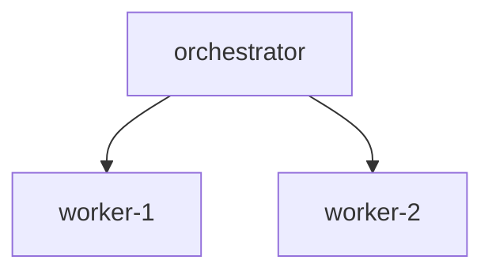

# Composer Templates

Agent composition patterns and templates for combining multiple agents into
composite systems. The architecture-subagent and generation-subagent consult
these when building orchestrated agent pipelines.

## Sequential Pipeline Template

**Pattern:** Prompt-Chaining (A -> B -> C)

```markdown
---
name: {name}-pipeline
description: Sequential pipeline: {A} -> {B} -> {C}
tools: {merged tools}
---

# Pipeline Flow
```
{A} -> {B} -> {C}
```

## Workflow
### Step 1: {A}
### Step 2: {B}
### Step 3: {C}

## Error Handling
- If any step fails, stop pipeline and report error
- Include which step failed and why
- Provide partial results if available
```

Pipeline I/O validation: each stage's `output_schema` must provide the
fields required by the next stage's `input_schema`. Untyped schemas
(empty) are always compatible.

## Parallel Execution Template

**Pattern:** Parallelization (A || B || C)

Aggregation strategies:

| Strategy | Behavior |
|----------|----------|
| `merge` | Combine all results into unified output (validates field type compatibility) |
| `vote` | Take majority consensus from results |
| `first` | Return first successful result |

```markdown
---
name: parallel-{A}-{B}-{C}
description: Parallel execution of: {A}, {B}, {C}
tools: {merged tools}
---

## Execution
1. Spawn ALL component agents concurrently via Task tool (single message)
2. Collect results as they complete
3. Aggregate using {strategy} strategy
4. Return combined result

## Error Handling
- Continue execution if some tasks fail
- Report partial results with failed task list
```

**Key rule:** All independent Task calls MUST be in the same message for
true concurrency. Do NOT wait for one task before starting another.

## Conditional Routing Template

**Pattern:** Routing (classifier -> handler)

```markdown
---
name: router-{name}
description: Routes requests to: {handlers}
tools: {merged tools}
---

## Routing Rules
- **{condition}** -> `{handler}`: {description}

## Classification Process
1. Analyze input to determine category
2. Match against routing rules
3. Dispatch to appropriate handler
4. Return handler result

## Fallback
If no rule matches:
1. Use default handler if defined
2. Otherwise, ask for clarification
3. Log unrouted requests for improvement
```

## Router Agent Template

For structured routing with category tags, keyword hints, and fallback:

```markdown
---
name: router-{name}
description: Routes requests across categories: {categories}
tools: {merged tools}
---

## Classification Process
1. Read the incoming request
2. Compare against each row of the routing table in order (first match wins)
3. If match found, dispatch to named handler with original input
4. If no rule matches, follow the Fallback Handler below

## Routing Table
| Category | Handler | When to use |
|----------|---------|-------------|
| `{category}` | `{handler_name}` | {description} |

## Classification Hints
- **{category}**: `keyword1`, `keyword2`, `keyword3`

## Fallback Handler
When no routing rule matches:
1. Ask user a clarifying question naming available categories
2. If reply matches a category, route accordingly
3. Otherwise, return explicit `unrouted` response
Never fabricate a routing decision when uncertain.
```

Validation: every `handler_name` in routing rules must match an
`AgentSpec.name` in the handlers list. Dangling references fail at compose
time, not runtime.

## Orchestrator-Workers Template

**Pattern:** Hierarchical (Orchestrator -> Workers)

```markdown
---
name: {name}
description: Orchestrates: {workers}
tools: Read, Grep, Glob, Task
---

## Available Workers
### {worker-name}
**Role:** {role}
**Description:** {description}
**Tools:** {tools}

## Workflow
### Phase 1: Analysis (receive, identify capabilities, determine workers)
### Phase 2: Decomposition
Strategy: **{dynamic|fixed|hybrid}**
### Phase 3: Execution (spawn via Task, manage deps, handle failures)
### Phase 4: Synthesis (combine outputs, verify, generate result)
```

Decomposition strategies:

| Strategy | Description |
|----------|-------------|
| `dynamic` | Analyze task at runtime to determine subtasks |
| `fixed` | Use predefined decomposition rules |
| `hybrid` | Combine predefined and dynamic decomposition |

## Composition Constants

| Constant | Value | Description |
|----------|-------|-------------|
| `MAX_COMPOSITION_DEPTH` | 3 | Hard limit on orchestrator nesting depth |
| `WARN_COMPOSITION_DEPTH` | 2 | Non-blocking warning threshold |
| `ROUTER_TABLE_HEADER` | `## Routing Table` | Sentinel for downstream parsers |
| `ROUTER_FALLBACK_HEADER` | `## Fallback Handler` | Sentinel for fallback section |

Depth validation:
- `depth < 1` -> error (invalid)
- `depth > MAX_COMPOSITION_DEPTH` -> error (too deep to debug)
- `depth >= WARN_COMPOSITION_DEPTH` -> warning (consider flattening)

## Mermaid Dependency Diagram

Dependency graphs render as Mermaid flowcharts for README embedding:



Visual conventions:
- `-->` normal dependency edge
- `-.->` cycle edge (dotted, highlights circular dependency)
- `MISSING: {name}` prefix on unresolved dependency nodes

## Compatibility Checks

Pre-composition validation:

| Check | Failure Condition |
|-------|-------------------|
| Minimum agents | Fewer than 2 agents |
| Name conflicts | Duplicate agent names |
| Dependency cycles | Circular references in `dependencies` |
| Sequential I/O | Output schema missing required input fields |
| Parallel outputs | Same field name with conflicting types across workers |

## Tool Merging Rules

1. Collect all tools from all agents, preserving first-seen order
2. Remove duplicates
3. Auto-add `Task` for multi-agent compositions (if not already present)
